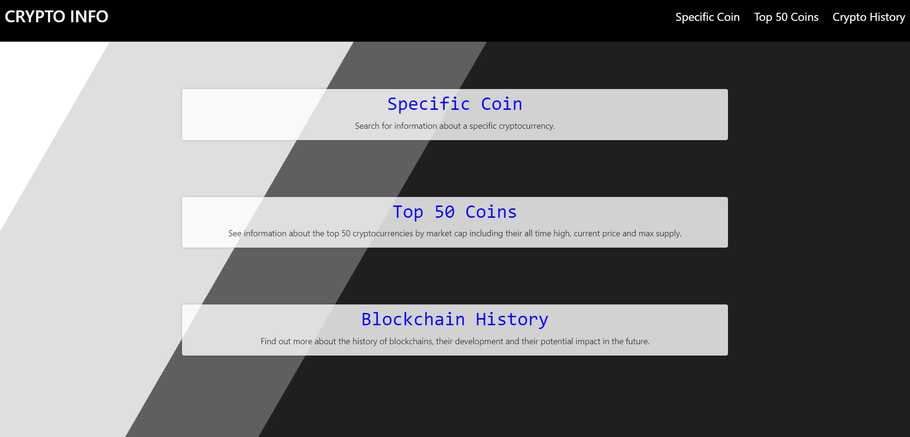

<h1>Crypto Prices</h1>

This app connects to the <a href="https://www.coingecko.com/en/api" target="_blank" rel="noreferrer"> Coingecko API</a> and gives the user the option to view th top 50 cryptocurrencies in a list with other information about them, view information about a single cryptocurrency or view
information about the history of blcokchains and their development. Its hosted on AWS using S3 and Cloudfront.

To run the app simply clone the repo, navigate to the directory, run ```npm install``` and then ```npm run start```. All data is kept in state so no need to set up a database or connect to one. Even the API URLs are hard coded into the app rather than kept in a .env file for ease of use. <br /><br />


